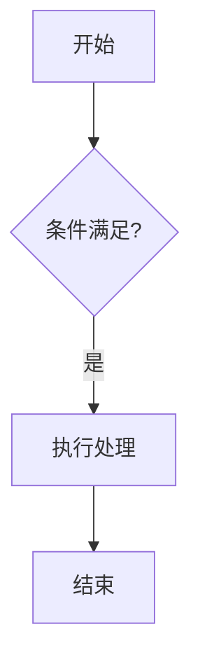
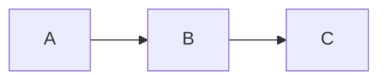
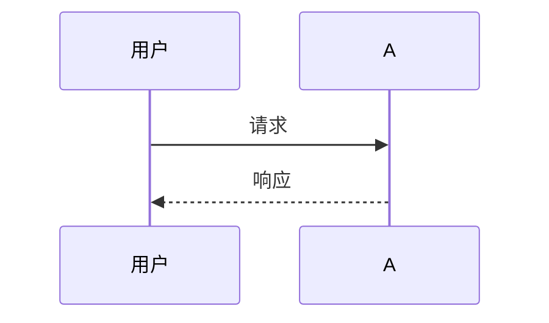

# Mermaid 往返

```mermaid
flowchart TD
    A[开始] --> B{条件满足?}
    B -- 是 --> C[执行处理]
    C --> D[结束]
```

正文段落,图表前后空行分隔。

```mermaid
graph LR
    A --> B --> C
```

时序图,带中文别名:

```mermaid
sequenceDiagram
    participant U as 用户
    U->>A: 请求
    A-->>U: 响应
```
